# VerdeTech 

**SustainableML: Energy-Performance Trade-offs in Python Libraries for Machine Learning**

[](https://www.python.org/downloads/)
[](https://ubuntu.com/)
[](LICENSE)

> Comprehensive benchmarking framework for measuring energy consumption and performance trade-offs across Python machine learning libraries.

## Overview

VerdeTech systematically evaluates the energy efficiency and performance characteristics of different Python ML libraries implementing identical algorithms. This research addresses the critical gap between ML performance optimization and energy sustainability.

### Key Contributions

- **Empirical Energy Analysis**: Measure real energy consumption using RAPL (CPU) and NVML (GPU)
- **Cross-Library Comparison**: Compare scikit-learn, XGBoost, PyTorch, TensorFlow, and scikit-learn-intelex
- **Statistical Rigor**: 780 experimental runs with 20 repetitions per configuration
- **Hardware Coverage**: CPU-only and GPU-accelerated implementations
- **Practical Insights**: Energy-performance trade-offs for sustainable ML development

## Experimental Setup

### Hardware Configuration
- **OS**: Ubuntu 20.04.6 LTS (GNU/Linux 5.15.0-107-generic, x86_64)
- **CPU**: 11th Gen Intel Core i7-1165G7 @ 2.80 GHz (4 cores, 8 threads)
- **GPU**: NVIDIA GeForce MX450 Laptop
- **RAM**: 16 GB
- **Storage**: 1.4 TB SSD

### Measurement Tools
- **EnergiBridge**: Primary energy measurement (RAPL for CPU, NVML for GPU)
- **ExperimentRunner**: Orchestration and scheduling framework
- **ps**: Real-time system monitoring
- **Python 3**: All implementations with pinned dependencies

## Installation

### Prerequisites
- Ubuntu 20.04
- Python 3.12.12
- NVIDIA GPU with CUDA support

### Setup Instructions

1. **Clone the repository**
```bash
git clone https://github.com/Vmr-wang/VerdeTech.git
cd VerdeTech
```

2. **Create conda environment**
```bash
# Create environment from configuration
conda env create -f environment.yml

# Activate environment
conda activate verdetech

# Verify installation
python -c "import sklearn, xgboost, torch, tensorflow as tf; print('All libraries installed successfully!')"
```


4. **Install additional tools**
[Install Experiment runner](https://github.com/S2-group/green-lab/blob/main/Lab%201/setup/Setup.md)


## Library Coverage

| Library | Version | Hardware Support | Algorithms |
|---------|---------|------------------|------------|
| **scikit-learn** | 1.6.1 | CPU | Logistic Regression, Decision Tree, K-Means, Ridge Regression |
| **scikit-learn-intelex** | 2025.0.0 | CPU (Intel optimized) | Logistic Regression, K-Means, Ridge Regression |
| **XGBoost** | 3.0.1 | CPU + GPU | Decision Tree Classifier, Ridge Regression |
| **PyTorch** | 2.8.0 | CPU + GPU | Logistic Regression, Ridge Regression |
| **TensorFlow** | 2.16.1 | CPU + GPU | K-Means |

## Usage

```shell
cd experiment-runner
```

Then run:
```bash
python __main__.py ml/RunnerConfig.py
```

## Project Structure

```
VerdeTech/
├── LICENSE                         # Project license
├── README.md                       # Project documentation
├── environment.yml                 # Conda environment specification
├── requirements.txt                # Python dependencies
├── RunnerConfig_nvidia.py          # NVIDIA-specific configuration
├── test.csv                        # Test data file
│
├── data-analysis/                  # Statistical analysis & visualization
│   ├── analysis.R                  # Main R analysis script
│   ├── figs/                       # Generated visualization plots
│   │   ├── Classification/         # Classification algorithm plots
│   │   ├── Clustering/             # Clustering algorithm plots
│   │   └── Regression/             # Regression algorithm plots
│   └── results/                    # Statistical analysis results
│       ├── Classification/         # Classification results (CSV files)
│       ├── Clustering/             # Clustering results (CSV files)
│       ├── Regression/             # Regression results (CSV files)
│       ├── DONE.txt               # Analysis completion marker
│       ├── outliers_report.csv    # Outliers analysis
│       └── sessionInfo.txt        # R session information
│
├── experiment-runner/              # Core experiment framework
│   ├── __main__.py                 # Framework entry point
│   ├── ConfigValidator/            # Configuration validation system
│   ├── EventManager/              # Event handling system
│   ├── ExperimentOrchestrator/     # Core experiment execution
│   ├── ExtendedTyping/            # Type system extensions
│   │
│   ├── ml/                        # Machine learning implementations
│   │   ├── DT_skl_cpu.py          # Decision Tree (scikit-learn, CPU)
│   │   ├── DT_xgb_cpu.py          # Decision Tree (XGBoost, CPU)
│   │   ├── DT_xgb_gpu.py          # Decision Tree (XGBoost, GPU)
│   │   ├── KMeans_skl_cpu.py      # K-Means (scikit-learn, CPU)
│   │   ├── KMeans_intelex_cpu.py  # K-Means (Intel Extension, CPU)
│   │   ├── KMeans_tf_gpu.py       # K-Means (TensorFlow, GPU)
│   │   ├── LR_skl_cpu.py          # Logistic Regression (scikit-learn, CPU)
│   │   ├── LR_intelex_cpu.py      # Logistic Regression (Intel Extension, CPU)
│   │   ├── LR_trh_gpu.py          # Logistic Regression (PyTorch, GPU)
│   │   ├── RR_skl_cpu.py          # Ridge Regression (scikit-learn, CPU)
│   │   ├── RR_intelex_cpu.py      # Ridge Regression (Intel Extension, CPU)
│   │   ├── RR_trh_gpu.py          # Ridge Regression (PyTorch, GPU)
│   │   └── RR_xgb_gpu.py          # Ridge Regression (XGBoost, GPU)
│   │
│   ├── Plugins/                   # Extensible plugin system
│   │   └── Profilers/             # Energy profiling plugins
│   │       ├── CodecarbonWrapper.py    # CodeCarbon integration
│   │       ├── EnergiBridge.py         # EnergiBridge hardware profiler
│   │       ├── NvidiaML.py             # NVIDIA ML profiling
│   │       ├── PowerJoular.py          # PowerJoular integration
│   │       ├── PowerMetrics.py         # Power metrics collection
│   │       └── WattsUpPro.py           # WattsUp Pro meter
│   │
│   ├── ProgressManager/           # Experiment progress tracking
│   ├── documentation/             # Framework documentation
│   ├── test/                      # Framework unit tests
│   └── test-standalone/           # Standalone test configurations
│
├── test/                          # Project-level tests
└── test-standalone/               # Standalone test suite
```

## Experimental Execution Plan

The complete experiment consists of 13 algorithm-library-hardware combinations:

| Algorithm | Library | Hardware | Dataset |
| :--- | :--- | :--- | :--- |
| Logical Regression | scikit-learn | CPU | {S, M, L} |
| Logical Regression | PyTorch | GPU | {S, M, L} |
| Logical Regression | scikit-learn-intelex | CPU | {S, M, L} |
| K-Means | scikit-learn | CPU | {S, M, L} |
| K-Means | scikit-learn-intelex | CPU | {S, M, L} |
| K-Means | TensorFlow | GPU | {S, M, L} |
| Decision Tree Classifier | scikit-learn | CPU | {S, M, L} |
| Decision Tree Classifier | XGBoost | CPU | {S, M, L} |
| Decision Tree Classifier | XGBoost | GPU | {S, M, L} |
| Ridge Regression | XGBoost | GPU | {S, M, L} |
| Ridge Regression | Pytorch | GPU | {S, M, L} |
| Ridge Regression | scikit-learn | CPU | {S, M, L} |
| Ridge Regression | scikit-learn-intelex | CPU | {S, M, L} |


### Estimated Execution Times
- **Small datasets** (Iris, Auto-mpg): ~10 seconds per run
- **Medium datasets** (Adult, California Housing): ~30 seconds per run  
- **Large datasets** (MNIST, NYC Taxi): ~90 seconds per run

**Total estimated duration**: ~50 hours including cool-down periods

## Data Analysis

Data analysis is done using `R 4.5.1`

### Statistical Methods
- **Normality Testing**: Shapiro-Wilk test
- **Variance Homogeneity**: Levene's test
- **Primary Analysis**: One-way ANOVA (parametric) or Kruskal-Wallis (non-parametric)
- **Post-hoc Testing**: Tukey's HSD or Dunn's test with Bonferroni correction
- **Correlation Analysis**: Pearson or Spearman correlation
- **Effect Size**: Cohen's d, Eta-squared, or Cliff's delta

### Output Files
- **run_table.csv**: Complete experimental results
- **statistical_results.json**: Hypothesis testing outcomes
- **energy_analysis.csv**: Energy consumption analysis
- **performance_correlations.csv**: Performance relationship data
Below are the main figures generated under `data-analysis/figs/`. Images are arranged by analysis type for a compact, readable layout.

#### Classification
<table>
<tr>
<td align="center">
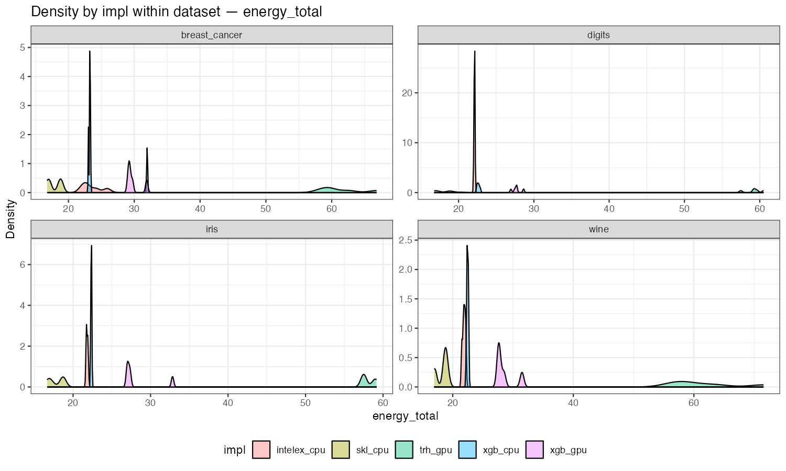
<br><em>Fig 1. Total energy consumption density by implementation and dataset (classification workloads).</em>
</td>
<td align="center">
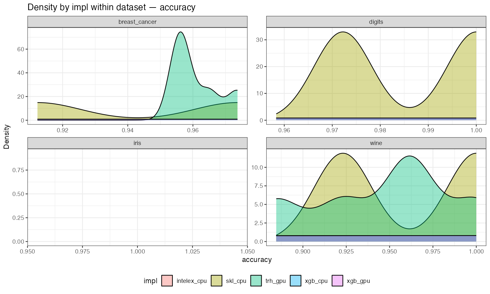
<br><em>Fig 2. Accuracy density per implementation and dataset.</em>
</td>
</tr>
<tr>
<td align="center">
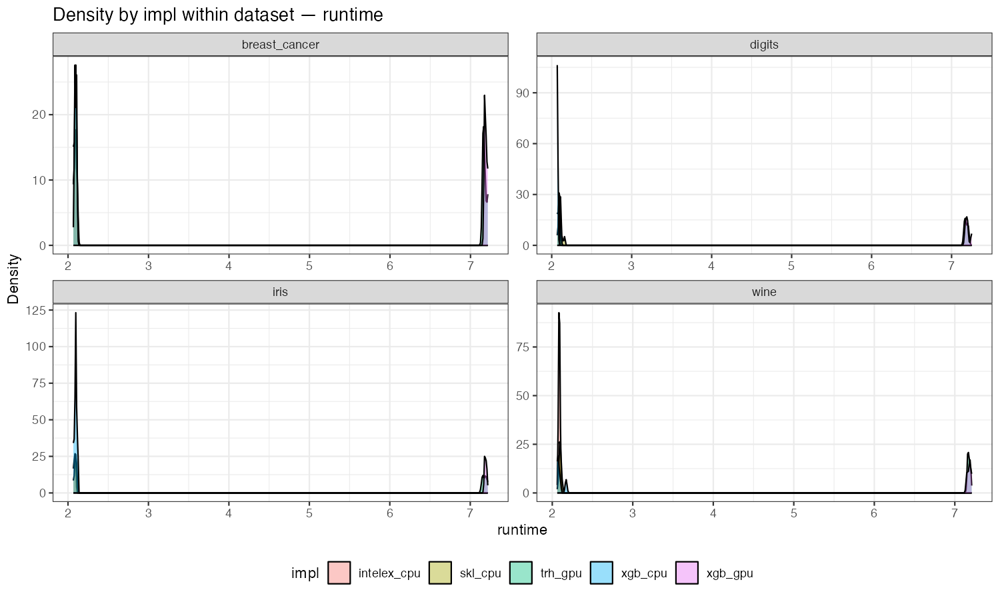
<br><em>Fig 3. Runtime density by implementation and dataset.</em>
</td>
<td align="center">
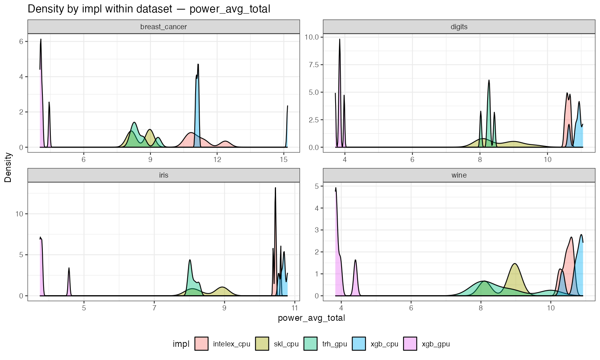
<br><em>Fig 4. Average total power consumption density.</em>
</td>
</tr>
</table>

#### Clustering
<table>
<tr>
<td align="center">
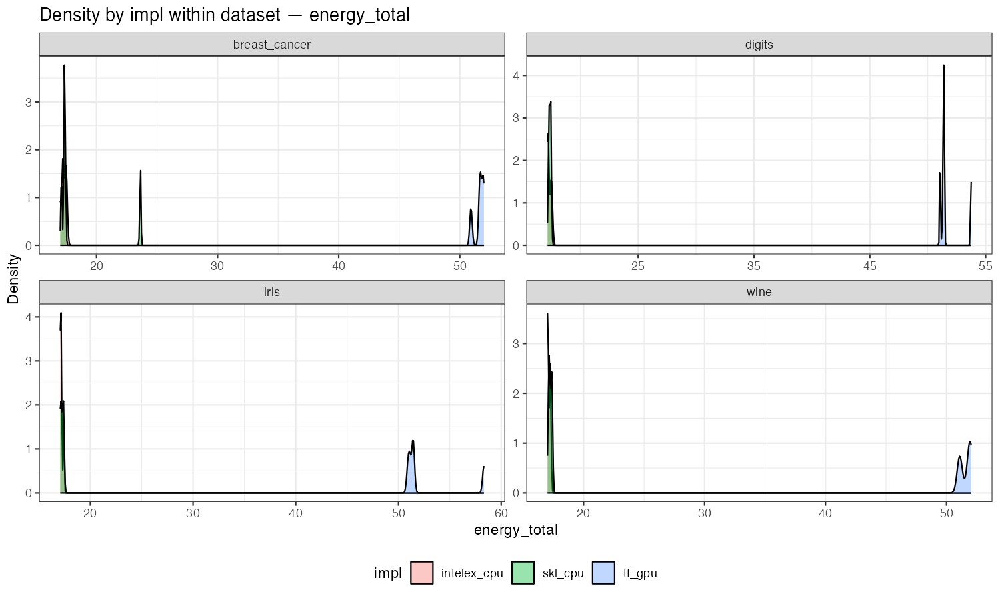
<br><em>Fig 5. Total energy consumption density for clustering algorithms.</em>
</td>
<td align="center">
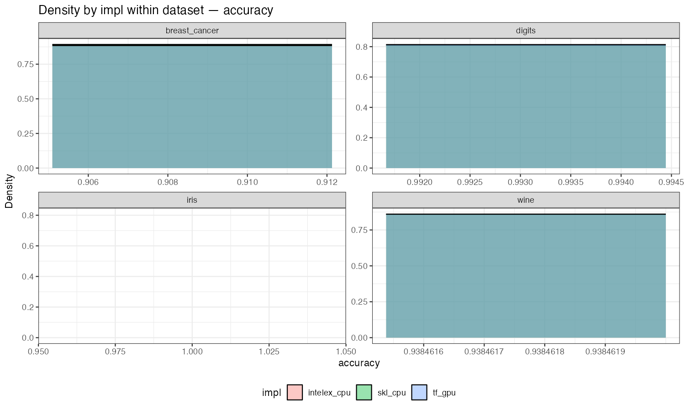
<br><em>Fig 6. Clustering accuracy density by implementation and dataset.</em>
</td>
</tr>
<tr>
<td align="center">
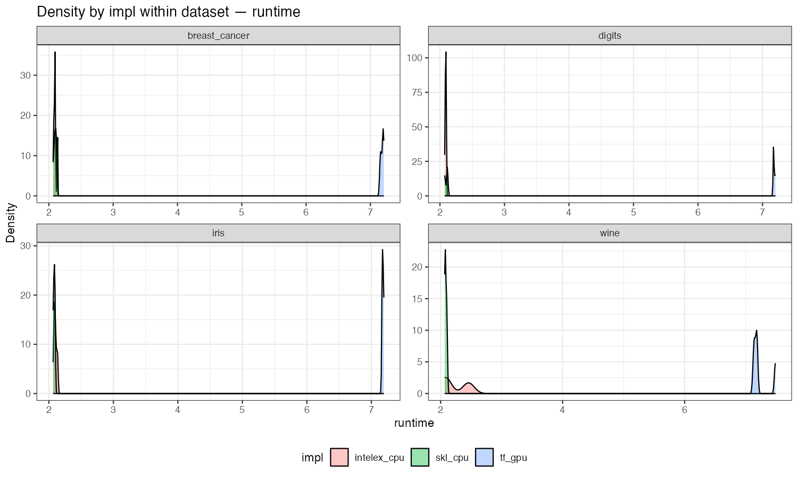
<br><em>Fig 7. Runtime density for clustering algorithms.</em>
</td>
<td align="center">
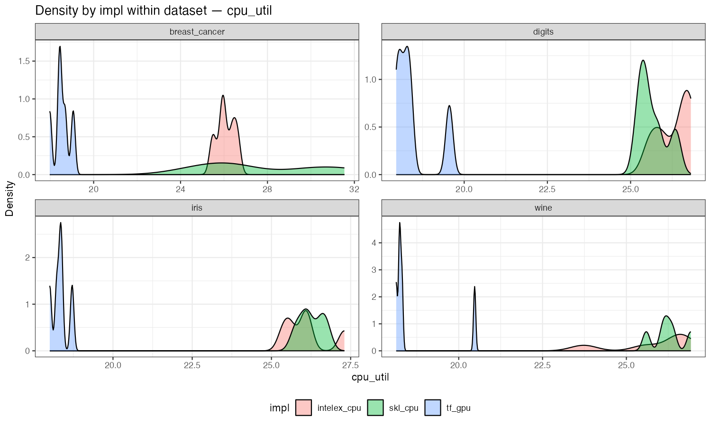
<br><em>Fig 8. CPU utilization density by implementation.</em>
</td>
</tr>
</table>

#### Regression
<table>
<tr>
<td align="center">
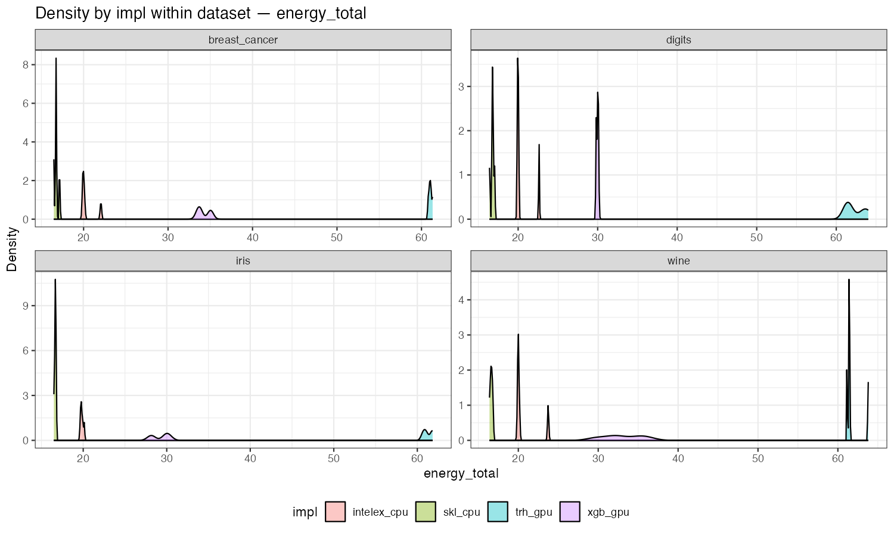
<br><em>Fig 9. Total energy consumption density for regression models.</em>
</td>
<td align="center">
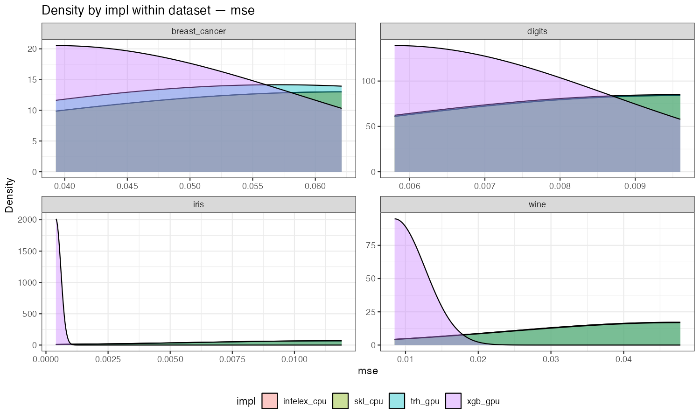
<br><em>Fig 10. Mean Squared Error density by implementation and dataset.</em>
</td>
</tr>
<tr>
<td align="center">
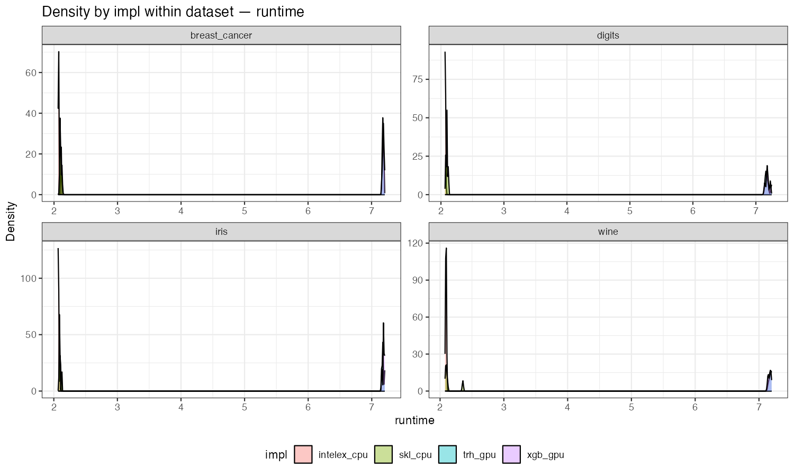
<br><em>Fig 11. Runtime density for regression models.</em>
</td>
<td align="center">
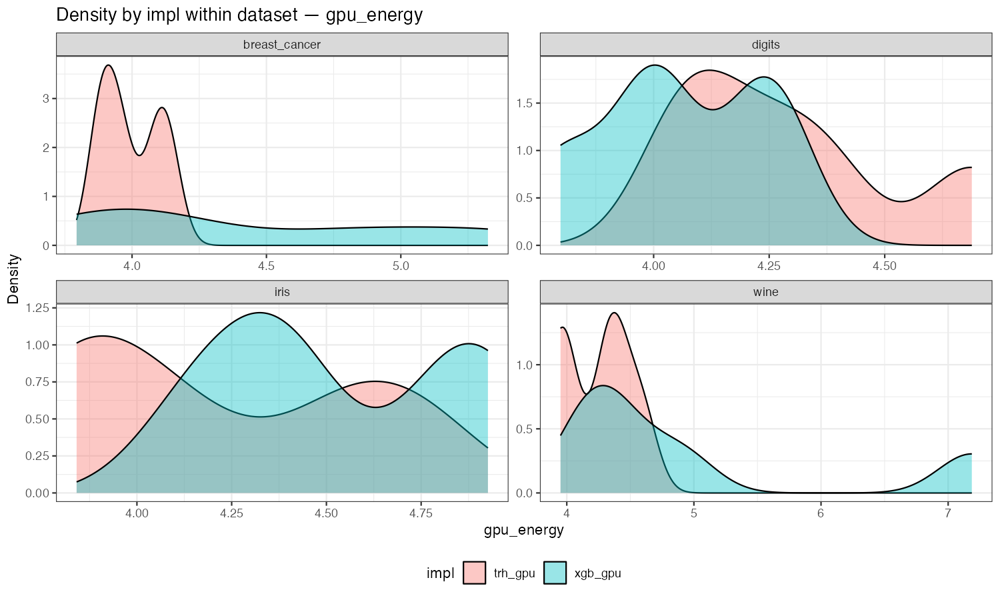
<br><em>Fig 12. GPU energy consumption density.</em>
</td>
</tr>
</table>

#### Detailed Performance Metrics
<table>
<tr>
<td align="center" colspan="2">
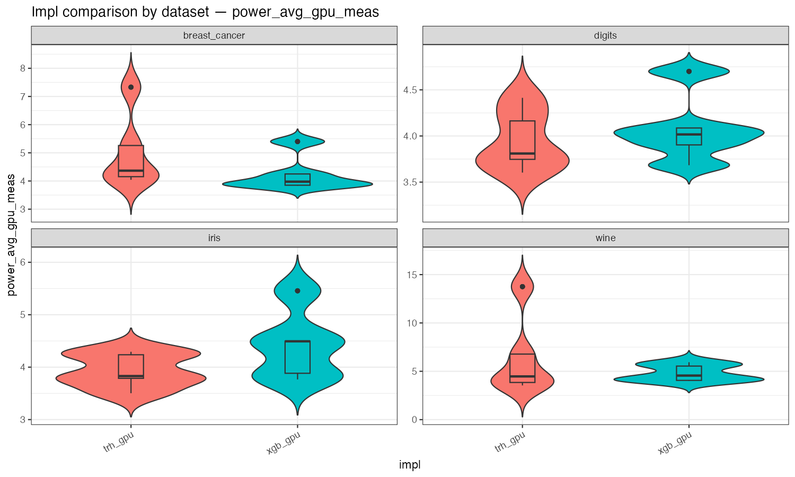
<br><em>Fig 13. GPU power consumption distribution (violin plot) for classification tasks.</em>
</td>
</tr>
</table>


## Citation

If you use VerdeTech in your research, please cite:

```bibtex
@inproceedings{shan2025sustainableml,
  title={SustainableML: Energy–Performance Trade-offs in Python Libraries for Machine Learning},
  author={Shan, Haoru and Liu, Mingshuo and Wang, Xuan and Xia, Yuanhao and Dong, Zixin},
  booktitle={Green Lab 2025/2026 - Vrije Universiteit Amsterdam},
  year={2025},
  address={Amsterdam, The Netherlands}
}
```

## License

This project is licensed under the MIT License - see the [LICENSE](LICENSE) file for details.

## Acknowledgments

- VU Amsterdam Green Lab Course 2025/2026
- EnergiBridge and ExperimentRunner frameworks
- Open-source ML library communities
- Research collaborators and advisors

---

**Making machine learning more sustainable through empirical energy analysis**
